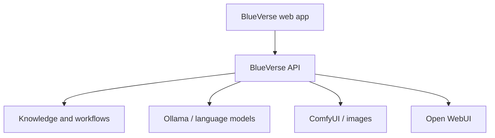

# Architecture

## Design goal

BlueVerse should own the experience and orchestration while AI engines remain separately installed services. This keeps the product boundary clear, reduces repository size, and makes third-party license obligations easier to manage.

## Current components

| Component | Responsibility | Status |
|---|---|---|
| `apps/web` | BlueVerse interface and navigation | Foundation |
| `apps/api` | Configuration, health checks, future orchestration | Foundation |
| Ollama | Local language-model runtime | External |
| Open WebUI | Optional existing chat interface | External |
| ComfyUI | Image generation workflows | External |
| Knowledge storage | Notes, originals, summaries, search | Planned |

## Data rules

1. Secrets come from runtime environment variables, never source files.
2. Customer data and conversations stay outside Git.
3. Each external model, LoRA, node, and integration is entered in the license inventory before commercial distribution.
4. The first commercial release should use authentication, audit logging, encrypted backups, role-based access, and a documented retention policy.
